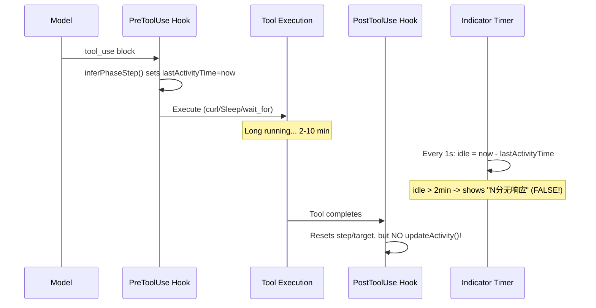
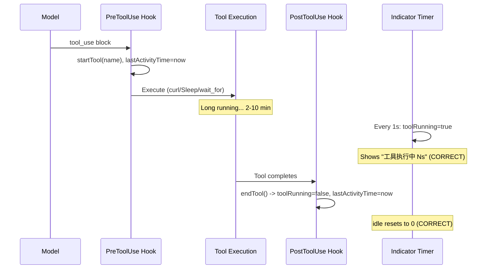

# Improve Tool Monitoring and Indicator System

## Root Cause Analysis

Three problems stem from the same architectural gap:



**Problem 1 & 2**: `lastActivityTime` is set at tool start only. Long-running tools (curl, Sleep, `browser_wait_for`) trigger false "无响应" after 2 minutes even though they're actively executing.

**Problem 3**: PostToolUse hook resets `step`/`toolTarget` but does NOT call `updateActivity()`. If the model resumes thinking after a tool completes, the idle timer counts from tool START, not tool END.

**Terminal garbling**: `baseLogMessage()` writes text to stdout BEFORE the indicator line is cleared from stderr. The indicator timer (every 1s on stderr) interleaves with stdout text output.

**Log timestamps**: All use `new Date().toISOString()` (UTC), hard to read for manual debugging.

## Changes

### 1. [indicator.js](src/common/indicator.js) - Tool tracking state + render pause

Add tool execution tracking fields and methods:

```javascript
// New fields in constructor:
this.toolRunning = false;
this.toolStartTime = 0;
this.currentToolName = '';
this._paused = false;

// New methods:
startTool(name)   // sets toolRunning=true, toolStartTime=now
endTool()         // sets toolRunning=false, updates lastActivityTime
pauseRendering()  // prevents _render() from writing to stderr
resumeRendering() // re-enables _render()
```

Modify `getStatusLine()` - when `toolRunning && idleMin >= 2`:

```javascript
// Current: always shows "N分无响应" after 2min idle
// Fix: distinguish "tool actively running" from "truly idle"
if (idleMin >= 2) {
  if (this.toolRunning) {
    const toolSec = Math.floor((Date.now() - this.toolStartTime) / 1000);
    line += ` | ${COLOR.yellow}工具执行中 ${toolSec}s${COLOR.reset}`;
  } else if (this.completionTimeoutMin) {
    line += ` | ${COLOR.red}${idleMin}分无响应（session_result...）${COLOR.reset}`;
  } else {
    line += ` | ${COLOR.red}${idleMin}分无响应（等待模型...）${COLOR.reset}`;
  }
}
```

The `contentKey` deduplication in `context.js` (`phase|step|toolTarget`) remains unchanged - `getStatusLine` adds dynamic info (tool elapsed time) but `contentKey` doesn't change, so no flooding occurs. The indicator timer's `_render()` uses `\r\x1b[K` to overwrite the same line every second.

Modify `_render()` to check `_paused` flag:

```javascript
_render() {
  if (this._paused) return;
  this.spinnerIndex++;
  process.stderr.write(`\r\x1b[K${this.getStatusLine()}`);
}
```

In `inferPhaseStep()`: add `indicator.startTool(toolName)` call.

Improve MCP tool handling in `inferPhaseStep()` - add a branch for `mcp__*` tools:

```javascript
} else if (name.startsWith('mcp__')) {
  indicator.updatePhase('coding');
  const action = name.split('__').pop() || name;
  indicator.updateStep(`浏览器: ${action}`);
  indicator.toolTarget = extractMcpTarget(toolInput);
}
```

Add `extractMcpTarget(input)` helper to extract meaningful targets from MCP tool inputs (url, text, element).

### 2. [hooks.js](src/core/hooks.js) - PostToolUse activity update

In `createCompletionModule` PostToolUse hook, add `indicator.endTool()`:

```javascript
hook: async (input, _toolUseID, _context) => {
  indicator.endTool();  // NEW: resets toolRunning, updates lastActivityTime
  indicator.updatePhase('thinking');
  indicator.updateStep('');
  indicator.toolTarget = '';
  // ... existing session_result detection ...
}
```

Change `logToolCall()` timestamp from `toISOString()` to local `HH:MM:SS`.

### 3. [logging.js](src/common/logging.js) - tool_result activity + timestamps

Add `indicator.updateActivity()` on `tool_result` messages:

```javascript
if (message.type === 'tool_result') {
  if (indicator) indicator.updateActivity();  // NEW
  // ... existing error logging ...
}
```

Change `writeSessionSeparator()` timestamp from `toISOString()` to local time format.

Create a shared `localTimestamp()` helper (can live in `utils.js` or inline):

```javascript
function localTimestamp() {
  const d = new Date();
  return `${String(d.getHours()).padStart(2,'0')}:${String(d.getMinutes()).padStart(2,'0')}:${String(d.getSeconds()).padStart(2,'0')}`;
}
```

### 4. [context.js](src/core/context.js) - Fix terminal garbling

Restructure `_logMessage()` to clear indicator BEFORE writing text:

```javascript
_logMessage(message) {
  const hasText = message.type === 'assistant'
    && message.message?.content?.some(b => b.type === 'text' && b.text);

  if (hasText && this.indicator) {
    this.indicator.pauseRendering();
    process.stderr.write('\r\x1b[K');  // Clear indicator BEFORE text output
  }

  baseLogMessage(message, this.logStream, this.indicator);  // writes text to stdout

  if (hasText && this.indicator) {
    const contentKey = `${this.indicator.phase}|${this.indicator.step}|${this.indicator.toolTarget}`;
    if (contentKey !== this._lastStatusKey) {
      this._lastStatusKey = contentKey;
      const statusLine = this.indicator.getStatusLine();
      if (statusLine) process.stderr.write(statusLine + '\n');
    }
    this.indicator.resumeRendering();
  }

  // Also handle tool_result (already handled in baseLogMessage for activity)
}
```

## Data Flow After Fix



## Impact Assessment

- All 4 files stay well under 500 lines
- `getStatusLine()` return value changes only when `toolRunning` is true (new yellow message instead of red) - does NOT affect `contentKey` deduplication, so no flooding
- Stall detection logic in `createStallModule` remains unchanged - it still uses `lastActivityTime`, which now correctly reflects tool completion time
- Backward compatible: no changes to hook interfaces or module exports