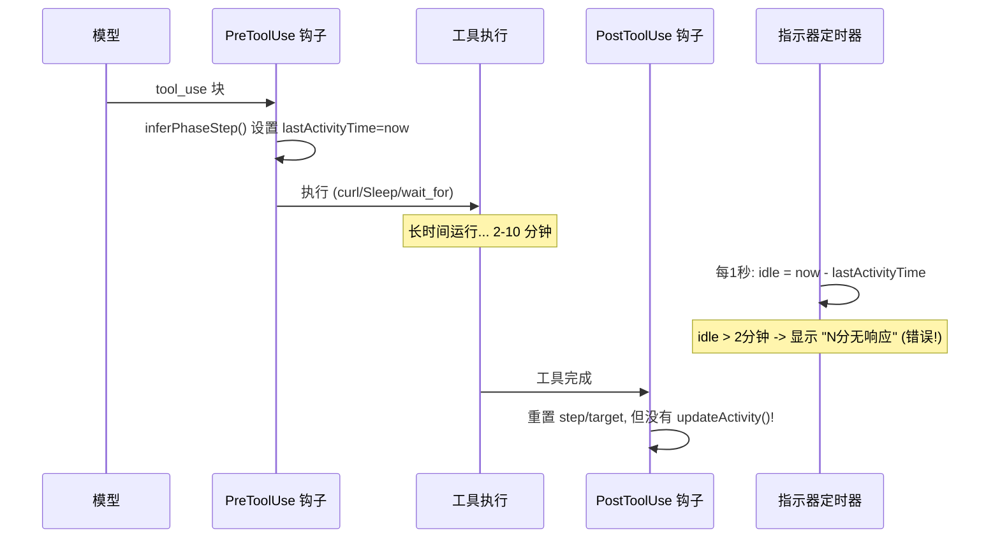
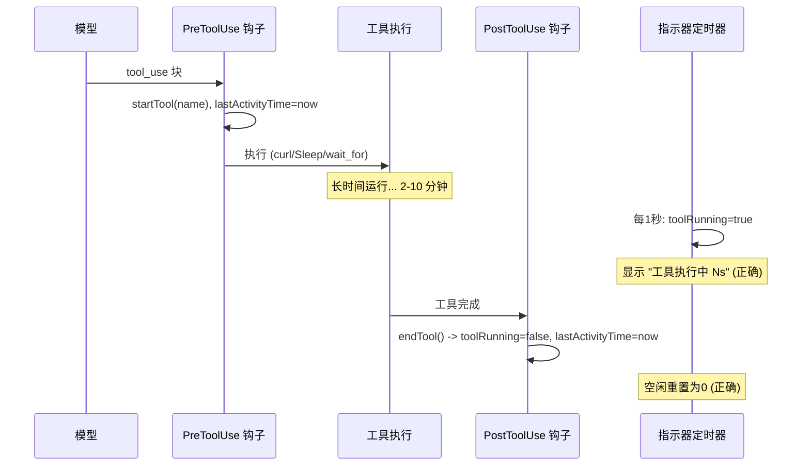

# 改进工具监控和指示系统

## 根本原因分析

三个问题源于同一个架构缺陷：



**问题1 & 2**: `lastActivityTime` 只在工具启动时设置。长时间运行的工具（curl、Sleep、`browser_wait_for`）即使在积极执行时也会在2分钟后触发错误的"无响应"。

**问题3**: PostToolUse钩子重置`step`/`toolTarget`但不调用`updateActivity()`。如果模型在工具完成后继续思考，空闲计时器会从工具开始而非结束计算。

**终端混乱**: `baseLogMessage()`在从stderr清除指示器行之前先向stdout写入文本。指示器定时器（每秒一次stderr）与stdout文本输出交错。

**日志时间戳**: 全部使用`new Date().toISOString()`（UTC），手动调试时难以阅读。

## 变更

### 1. [indicator.js](src/common/indicator.js) - 工具跟踪状态 + 渲染暂停

添加工具执行跟踪字段和方法：

```javascript
// 构造函数中的新字段：
this.toolRunning = false;
this.toolStartTime = 0;
this.currentToolName = '';
this._paused = false;

// 新方法：
startTool(name)   // 设置 toolRunning=true, toolStartTime=now
endTool()         // 设置 toolRunning=false, 更新 lastActivityTime
pauseRendering()  // 防止 _render() 写入 stderr
resumeRendering() // 重新启用 _render()
```

修改`getStatusLine()` - 当`toolRunning && idleMin >= 2`时：

```javascript
// 当前：空闲2分钟后始终显示 "N分无响应"
// 修复：区分"工具正在积极运行"和"真正空闲"
if (idleMin >= 2) {
  if (this.toolRunning) {
    const toolSec = Math.floor((Date.now() - this.toolStartTime) / 1000);
    line += ` | ${COLOR.yellow}工具执行中 ${toolSec}s${COLOR.reset}`;
  } else if (this.completionTimeoutMin) {
    line += ` | ${COLOR.red}${idleMin}分无响应（session_result...）${COLOR.reset}`;
  } else {
    line += ` | ${COLOR.red}${idleMin}分无响应（等待模型...）${COLOR.reset}`;
  }
}
```

`context.js`中的`contentKey`去重（`phase|step|toolTarget`）保持不变 - `getStatusLine`添加动态信息（工具已用时间）但`contentKey`不会改变，因此不会出现泛滥。指示器定时器的`_render()`使用`\r\x1b[K`覆盖同一行每秒。

修改`_render()`以检查`_paused`标志：

```javascript
_render() {
  if (this._paused) return;
  this.spinnerIndex++;
  process.stderr.write(`\r\x1b[K${this.getStatusLine()}`);
}
```

在`inferPhaseStep()`中：添加`indicator.startTool(toolName)`调用。

改进`inferPhaseStep()`中的MCP工具处理 - 为`mcp__*`工具添加分支：

```javascript
} else if (name.startsWith('mcp__')) {
  indicator.updatePhase('coding');
  const action = name.split('__').pop() || name;
  indicator.updateStep(`浏览器: ${action}`);
  indicator.toolTarget = extractMcpTarget(toolInput);
}
```

添加`extractMcpTarget(input)`辅助函数，从MCP工具输入中提取有意义的目标（url、text、element）。

### 2. [hooks.js](src/core/hooks.js) - PostToolUse活动更新

在`createCompletionModule` PostToolUse钩子中，添加`indicator.endTool()`：

```javascript
hook: async (input, _toolUseID, _context) => {
  indicator.endTool();  // 新增：重置toolRunning，更新lastActivityTime
  indicator.updatePhase('thinking');
  indicator.updateStep('');
  indicator.toolTarget = '';
  // ... 现有的 session_result 检测 ...
}
```

将`logToolCall()`时间戳从`toISOString()`改为本地`HH:MM:SS`。

### 3. [logging.js](src/common/logging.js) - tool_result活动 + 时间戳

在`tool_result`消息上添加`indicator.updateActivity()`：

```javascript
if (message.type === 'tool_result') {
  if (indicator) indicator.updateActivity();  // 新增
  // ... 现有的错误日志记录 ...
}
```

将`writeSessionSeparator()`时间戳从`toISOString()`改为本地时间格式。

创建共享的`localTimestamp()`辅助函数（可以放在`utils.js`或内联）：

```javascript
function localTimestamp() {
  const d = new Date();
  return `${String(d.getHours()).padStart(2,'0')}:${String(d.getMinutes()).padStart(2,'0')}:${String(d.getSeconds()).padStart(2,'0')}`;
}
```

### 4. [context.js](src/core/context.js) - 修复终端混乱

重构`_logMessage()`以在写入文本之前清除指示器：

```javascript
_logMessage(message) {
  const hasText = message.type === 'assistant'
    && message.message?.content?.some(b => b.type === 'text' && b.text);

  if (hasText && this.indicator) {
    this.indicator.pauseRendering();
    process.stderr.write('\r\x1b[K');  // 在文本输出前清除指示器
  }

  baseLogMessage(message, this.logStream, this.indicator);  // 向stdout写入文本

  if (hasText && this.indicator) {
    const contentKey = `${this.indicator.phase}|${this.indicator.step}|${this.indicator.toolTarget}`;
    if (contentKey !== this._lastStatusKey) {
      this._lastStatusKey = contentKey;
      const statusLine = this.indicator.getStatusLine();
      if (statusLine) process.stderr.write(statusLine + '\n');
    }
    this.indicator.resumeRendering();
  }

  // 同样处理 tool_result (已在baseLogMessage中为活动处理)
}
```

## 修复后数据流



## 影响评估

- 所有4个文件都保持在500行以下
- `getStatusLine()`返回值仅在`toolRunning`为真时更改（新的黄色消息替代红色）- 不影响`contentKey`去重，因此不会出现泛滥
- `createStallModule`中的停滞检测逻辑保持不变 - 它仍使用`lastActivityTime`，现在能正确反映工具完成时间
- 向后兼容：钩子接口或模块导出没有变化