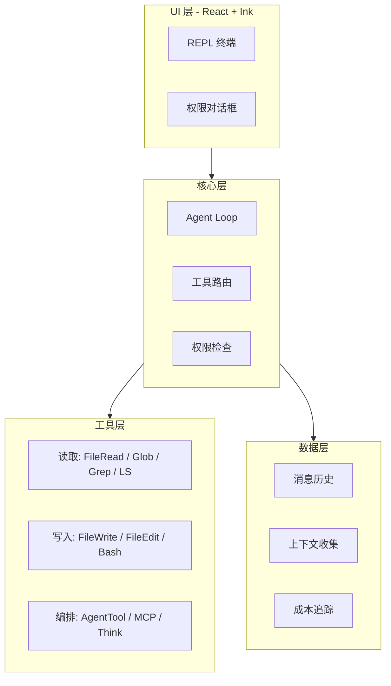
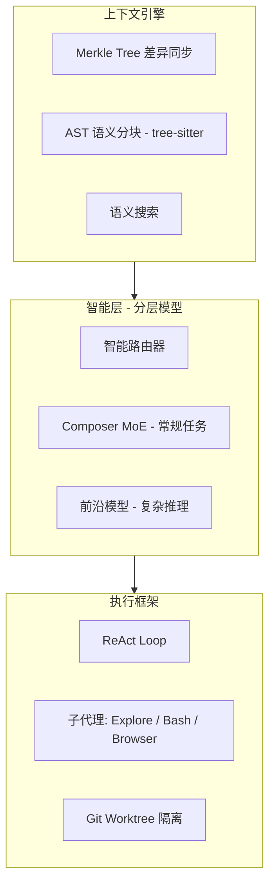
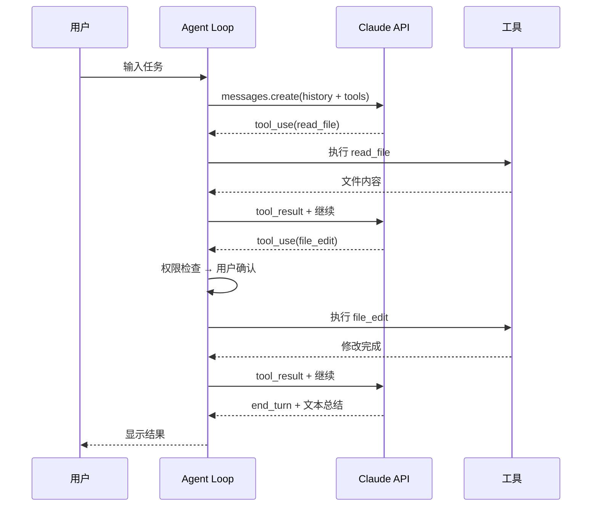
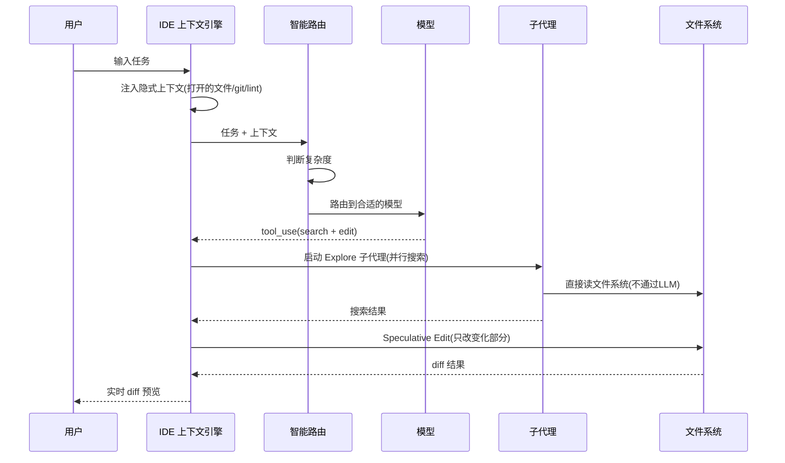

# 参照目标：Claude Code vs Cursor

> 两个参照物。构建自己的 Agent 时，对照它们的设计决策。

---

## 架构哲学

**Claude Code** = 简单工具 + 强模型（把复杂性交给 LLM，工具层保持薄）
**Cursor** = 工程优化（自研模型 + AST 解析 + 推测性编辑，降低延迟和成本）

---

## 核心对比

| 维度 | Claude Code (CLI) | Cursor (IDE) |
|------|-------------------|--------------|
| 形态 | 终端 CLI | VS Code Fork (Electron) |
| 模型策略 | 单模型（Claude） | 分层路由（Composer + 前沿模型） |
| 上下文 | 按需工具读取 | Merkle Tree 主动同步 + AST 语义分块 |
| 并行 | AgentTool 子代理（串行工具执行） | Git Worktree 多代理（最多 8 个并行） |
| 文件编辑 | FileEditTool (Search & Replace) | Speculative Edits (250 tok/s) |
| 速度 | 依赖 API 端 | 自研模型 4x 快 |
| 适合 | 自动化流水线、CI/CD | 交互式开发 |

---

## Claude Code 架构

### 工具分类

| 类型 | 工具 | 说明 |
|------|------|------|
| 读取 | FileRead, Glob, Grep, LS | 不修改环境，免授权 |
| 写入 | FileWrite, FileEdit, Bash | 需权限确认 |
| 编排 | AgentTool, MCP, Think | AgentTool 启动独立子代理 |

### 优势

- 架构简单，一个 while 循环就是核心
- 工具层薄，容易复刻和理解
- 可编程（SDK），适合自动化流水线
- 权限系统设计清晰（读免授权 / 写需授权 / 拒绝反馈给模型）

### 劣势

- 工具串行执行，速度受限
- 文件操作全部通过 LLM（每次读文件都消耗 token）
- 无代码感知（不理解 AST，依赖模型理解代码结构）
- 纯文本界面，无 diff 预览

---

## Cursor 架构

### 核心技术

| 技术 | 作用 |
|------|------|
| Composer (MoE) | 自研模型，250 tok/s，常规任务 |
| Merkle Tree | 文件变化差异同步，毫秒级 |
| tree-sitter | 代码 AST 解析，按逻辑单元（函数/类）分块 |
| Speculative Edits | 90% 内容不变，只在修改处生成 token |
| Git Worktree | 多代理隔离，互不干扰 |

### 优势

- 子代理并行（最多 8 个），效率远高于 CLI
- 直接文件系统访问 + LSP，不通过 LLM 读文件
- AST 语义分块，上下文质量高
- diff 预览、实时编辑反馈
- 隐式上下文注入（打开的文件、git 状态、linter 错误自动注入）

### 劣势

- 闭源，无法编程扩展核心
- 架构复杂，复刻成本高
- 依赖 Electron，资源占用大
- 自研模型需要大量训练投入

---

## 数据流对比

### Claude Code 一次完整调用

### Cursor 一次完整调用

---

## 对你构建 Agent 的启示

**短期（阶段 1）：走 Claude Code 路线**
- while 循环 + 薄工具层，快速可用
- 先实现：read_file, write_file, edit_file, execute_bash
- 后加：grep_search, glob, think

**中期（阶段 2-3）：借鉴 Cursor 的工程优化**
- 多模型路由（FAST_MODEL / STRONG_MODEL）
- 结果截断 + 消息裁剪
- 子代理隔离（避免上下文污染）

**长期（阶段 4）：如果做产品**
- VS Code 插件（LSP + 文件系统直接访问）
- 或 VS Code Fork（Cursor/Trae 路线）

---

## 参考资料

- [Reverse engineering Claude Code](https://www.reidbarber.com/blog/reverse-engineering-claude-code) — Claude Code 逆向
- [Cursor Agent 架构案例研究](https://medium.com/@khayyam.h/designing-high-performance-agentic-systems-an-architectural-case-study-of-the-cursor-agent-ab624e4a0a64)
- [nano-claude-code](https://github.com/cthiriet/nano-claude-code) — 200 行最小 Claude Code
- [claude-agent-sdk-python](https://github.com/anthropics/claude-agent-sdk-python) — 开源 SDK，可读源码
- [Cursor Subagents 文档](https://cursor.com/docs/subagents.md)
- [Cursor Parallel Agents](https://cursor.com/docs/configuration/worktrees)
